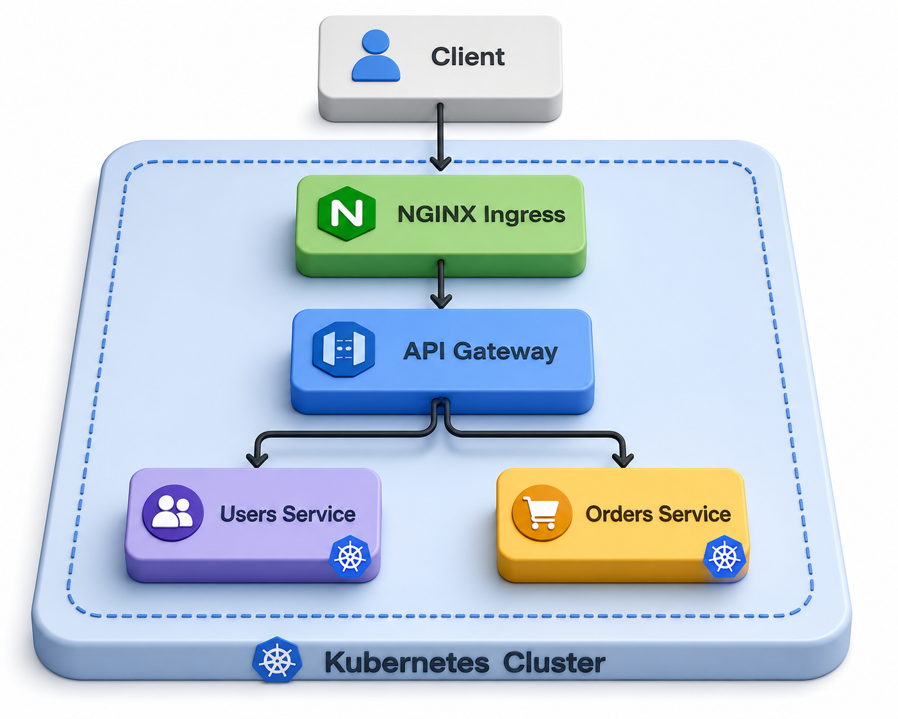
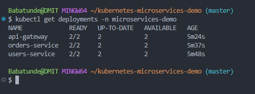
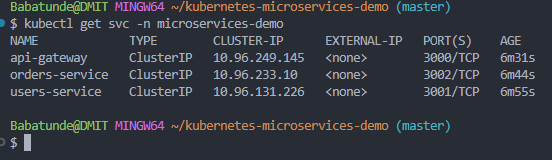
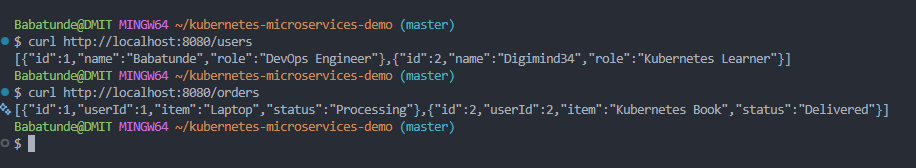

# Kubernetes Microservices Demo

A DevOps portfolio project demonstrating how to containerize and deploy a microservices-based application using Docker, Kubernetes, and CI/CD.

## Project Goals

- Build multiple microservices
- Containerize each service with Docker
- Run services locally with Docker Compose
- Deploy services to Kubernetes
- Configure Kubernetes Deployments, Services, ConfigMaps, and Ingress
- Add CI/CD using GitHub Actions

## Architecture

Frontend → API Gateway → Users Service  
Frontend → API Gateway → Orders Service

text
Client
  |
  v
NGINX Ingress
  |
  v
API Gateway
  |
  |--- Users Service
  |
  |--- Orders Service

##Tech Stack
Node.js
Express.js
Axios
Docker
Docker Hub
Kubernetes
NGINX Ingress Controller
kubectl
Git/GitHub
Docker Images
digi2/api-gateway:v1
digi2/users-service:v1
digi2/orders-service:v1
Kubernetes Resources
Namespace: microservices-demo
---
## Running Pods

---

---
## Deployments

---
Deployments:
- api-gateway
- users-service
- orders-service

## Services

Services:
- api-gateway
- users-service
- orders-service

Ingress:
- api-gateway-ingress
API Endpoints

Through port-forward:

kubectl port-forward svc/api-gateway 3000:3000 -n microservices-demo
----
## API Gateway Communication

---
----
[services](docs/screenshots/services.png)
---

---
[Pods-running](docs/screenshots/pods-running.png)
---

---
[Deployment](docs/screenshots/successful-deployment.png)

Test:

!curl http://localhost:3000

curl http://localhost:3000/users

curl http://localhost:3000/orders

curl http://localhost:3000/health

Through Ingress:

curl http://microservices-demo.local
curl http://microservices-demo.local/users
curl http://microservices-demo.local/orders
Deploy to Kubernetes
kubectl apply -f k8s/namespace.yaml
kubectl apply -f k8s/users-service/
kubectl apply -f k8s/orders-service/
kubectl apply -f k8s/api-gateway/

Verify:

kubectl get deployments -n microservices-demo
kubectl get pods -n microservices-demo
kubectl get svc -n microservices-demo
kubectl get ingress -n microservices-demo
Local Host Mapping

For Windows, add this to:

C:\Windows\System32\drivers\etc\hosts
172.23.0.5 microservices-demo.local

Then flush DNS:

ipconfig /flushdns
Project Status

Completed:

Created 3 Node.js microservices
Built Docker images
Pushed images to Docker Hub
Deployed services to Kubernetes
Configured Kubernetes Deployments and Services
Verified service-to-service communication
Added NGINX Ingress routing
Author

Babatunde / Digi2
