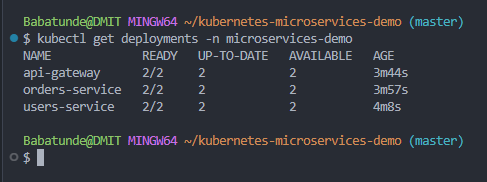
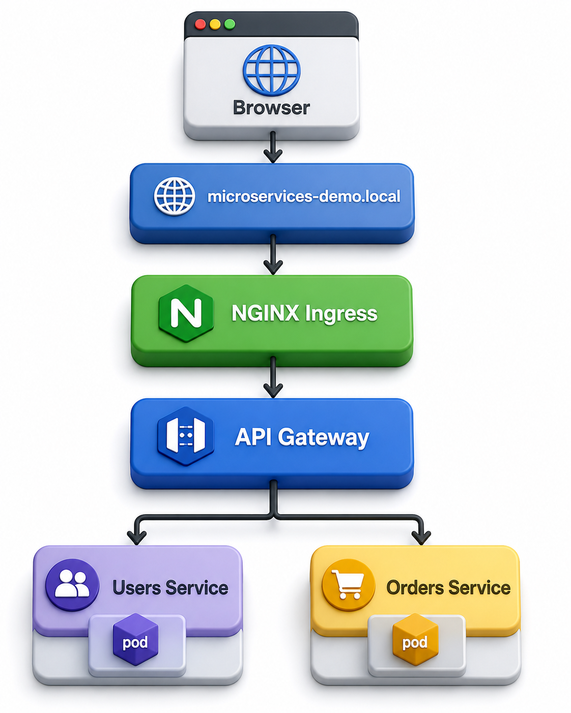

# Kubernetes Microservices Demo

A DevOps portfolio project demonstrating how to containerize and deploy a microservices-based application using Docker, Kubernetes, API Gateway, and NGINX Ingress.

---

## Project Goals

- Build multiple microservices
- Containerize each service with Docker
- Push images to Docker Hub
- Deploy services to Kubernetes
- Configure Kubernetes Deployments, Services, and Ingress
- Implement service-to-service communication
- Build an API Gateway pattern
- Learn Kubernetes networking and DNS

---

## Architecture


### Architecture Flow

```text
Client
   |
   v
NGINX Ingress
   |
   v
API Gateway
   |
   +------ Users Service
   |
   +------ Orders Service
```

---

## Features

- Dockerized microservices
- Kubernetes Deployments
- Kubernetes Services
- API Gateway
- NGINX Ingress Controller
- Service-to-Service Communication
- Docker Hub Integration
- Kubernetes DNS
- Horizontal Scaling Ready

---

## Tech Stack

```text
Node.js
Express.js
Docker
Docker Hub
Kubernetes
NGINX Ingress Controller
kubectl
Git/GitHub
```

---

## Docker Images

```text
digi2/api-gateway:v1
digi2/users-service:v1
digi2/orders-service:v1
```

---

## Kubernetes Resources

### Namespace

```text
microservices-demo
```

### Deployments

- api-gateway
- users-service
- orders-service

### Services

- api-gateway
- users-service
- orders-service

### Ingress

- api-gateway-ingress

---

## Project Structure

```text
kubernetes-microservices-demo/
│
├── docs/
│   ├── images/
│   │   ├── architecture.png
│   │   ├── deployments.png
│   │   ├── kubernetes-resources.png
│   │   └── request-flow.png
│   │
│   └── screenshots/
│       ├── api-gateway-users.png
│       ├── pods-running.png
│       ├── services.png
│       └── successful-deployment.png
│
├── k8s/
│   ├── namespace.yaml
│   ├── users-service/
│   ├── orders-service/
│   └── api-gateway/
│
├── services/
│   ├── users-service/
│   ├── orders-service/
│   └── api-gateway/
│
├── docker-compose.yml
└── README.md
```

---

# Running Pods



---

# Deployments


Current Deployments:

- api-gateway
- users-service
- orders-service

---

# Services


Current Services:

- api-gateway
- users-service
- orders-service

---

# API Gateway Communication


The API Gateway routes requests internally using Kubernetes DNS.

Examples:

```text
http://users-service:3001/users
http://orders-service:3002/orders
```

---

# Request Flow



```text
Client
  |
  v
NGINX Ingress
  |
  v
API Gateway
  |
  +------ Users Service
  |
  +------ Orders Service
```

---

# Local Development

Port-forward API Gateway:

```bash
kubectl port-forward svc/api-gateway 8080:3000 -n microservices-demo
```

---

# Testing

## API Gateway Health Check

```bash
curl http://localhost:8080
```

Expected Response:

```json
{
  "service": "api-gateway",
  "status": "running",
  "message": "API Gateway is working"
}
```

---

## Users Service

```bash
curl http://localhost:8080/users
```

Expected Response:

```json
[
  {
    "id": 1,
    "name": "Babatunde",
    "role": "DevOps Engineer"
  },
  {
    "id": 2,
    "name": "Digimind34",
    "role": "Kubernetes Learner"
  }
]
```

---

## Orders Service

```bash
curl http://localhost:8080/orders
```

Expected Response:

```json
[
  {
    "id": 1,
    "userId": 1,
    "item": "Laptop",
    "status": "Processing"
  },
  {
    "id": 2,
    "userId": 2,
    "item": "Kubernetes Book",
    "status": "Delivered"
  }
]
```

---

# Through Ingress

```bash
curl http://microservices-demo.local
```

```bash
curl http://microservices-demo.local/users
```

```bash
curl http://microservices-demo.local/orders
```

---

# Deploy to Kubernetes

Create namespace:

```bash
kubectl apply -f k8s/namespace.yaml
```

Deploy Users Service:

```bash
kubectl apply -f k8s/users-service/
```

Deploy Orders Service:

```bash
kubectl apply -f k8s/orders-service/
```

Deploy API Gateway:

```bash
kubectl apply -f k8s/api-gateway/
```

---

# Verify Deployment

Check Deployments:

```bash
kubectl get deployments -n microservices-demo
```

Check Pods:

```bash
kubectl get pods -n microservices-demo
```

Check Services:

```bash
kubectl get svc -n microservices-demo
```

Check Ingress:

```bash
kubectl get ingress -n microservices-demo
```

---

# Local Host Mapping

For Windows, add the following line to:

```text
C:\Windows\System32\drivers\etc\hosts
```

```text
172.23.0.5 microservices-demo.local
```

Flush DNS cache:

```powershell
ipconfig /flushdns
```

---

# Screenshots

## Successful Deployment


## Running Pods


## Services


## API Gateway


---

# Lessons Learned

This project provided hands-on experience with:

- Docker image creation
- Docker Hub image management
- Kubernetes Deployments
- Kubernetes Services
- Kubernetes DNS
- Service Discovery
- ReplicaSets
- API Gateway Architecture
- NGINX Ingress Controller
- Kubernetes Networking
- Port Forwarding
- Troubleshooting Kubernetes Clusters

---

# Future Improvements

- GitHub Actions CI/CD
- Automated Docker Image Builds
- Automated Kubernetes Deployments
- Prometheus Monitoring
- Grafana Dashboards
- Centralized Logging
- Helm Charts
- AWS EKS Deployment
- ArgoCD GitOps Workflow

---

# Project Status

✅ Users Service Complete

✅ Orders Service Complete

✅ API Gateway Complete

✅ Dockerized Services

✅ Docker Hub Integration

✅ Kubernetes Deployments

✅ Kubernetes Services

✅ NGINX Ingress

✅ Service Discovery

✅ Documentation Complete

⏳ CI/CD Pipeline (Next Phase)

⏳ Monitoring & Observability

⏳ Production Deployment

---

# Author

**Babatunde (Digimind34)**

DevOps Engineer | Cloud Engineer | Kubernetes Engineer

GitHub: https://github.com/digimind34

---